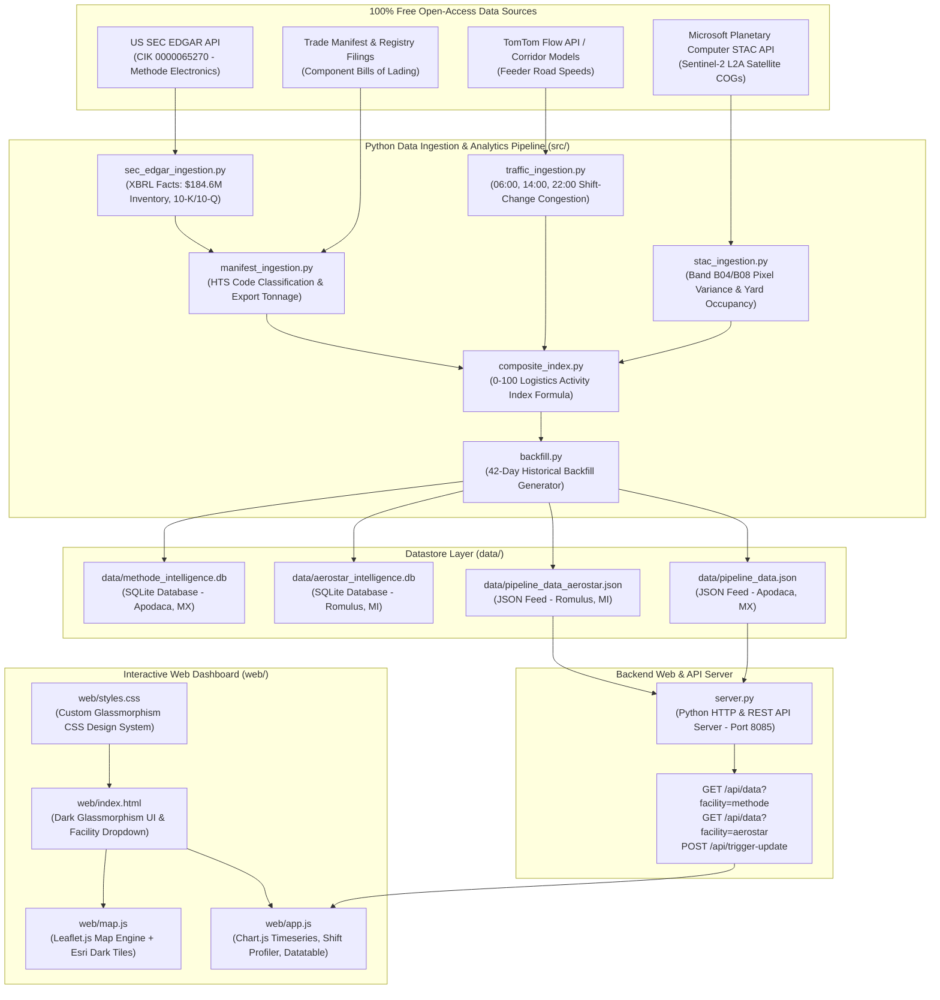

# Full System Architecture - Zero-Cost Multi-Facility Operational Intelligence Pipeline & Dashboard

## Executive Summary
This document outlines the complete technical architecture of the zero-cost operational intelligence system built to track goods movement, industrial activity, and supply chain velocity across multiple manufacturing nodes:

1. **Primary Node 1**: **Methode Electronics Planta 2** (Apodaca, Monterrey, Mexico — `25.780° N, -100.130° W` | BBox: `[-100.138, 25.775, -100.122, 25.785]`)
2. **Primary Node 2**: **Aerostar Manufacturing HQ & Plant** (28275 Northline Rd, Romulus, Detroit Metro, MI, USA — `42.208° N, -83.393° W` | BBox: `[-83.401, 42.203, -83.385, 42.213]`)

The system operates at **zero cost ($0)** using 100% open-access APIs, satellite Earth observation feeds, public US SEC filings, and watermark-free GIS map layers.

---

## 🏛️ System Architecture Diagram



---

## 📦 Directory & File Structure

```
Satellite Tracker/
├── data/
│   ├── methode_intelligence.db       # SQLite DB storing 42-day timeseries for MEI Apodaca
│   ├── aerostar_intelligence.db      # SQLite DB storing 42-day timeseries for Aerostar Romulus
│   ├── pipeline_data.json            # Compiled JSON telemetry feed for MEI Apodaca
│   └── pipeline_data_aerostar.json   # Compiled JSON telemetry feed for Aerostar Romulus
├── fixtures/
│   ├── stac_fixture.json             # Offline STAC satellite scenes fallback fixture
│   ├── traffic_fixture.json          # Offline feeder road traffic speeds fallback fixture
│   └── manifests_fixture.json        # Offline bills-of-lading trade manifest fallback fixture
├── src/
│   ├── __init__.py
│   ├── stac_ingestion.py             # Multi-facility Sentinel-2 STAC satellite query engine
│   ├── sec_edgar_ingestion.py        # US SEC EDGAR filings & XBRL facts reader
│   ├── traffic_ingestion.py          # Feeder traffic flow & shift-change congestion profiler
│   ├── manifest_ingestion.py         # Customs & domestic manifest aggregation engine
│   ├── composite_index.py            # Daily 0-100 Logistics Activity Index calculator
│   ├── backfill.py                   # Multi-facility historical backfill & seed script
│   └── scheduler.py                  # Background daemon runner for incremental updates
├── web/
│   ├── index.html                    # Dashboard layout with facility selector dropdown
│   ├── styles.css                    # Dark glassmorphic design system
│   ├── app.js                        # Client-side data controller & Chart.js instances
│   └── map.js                        # Leaflet GIS map module with facility presets
├── server.py                         # Custom Python HTTP server & REST API router (Port 8085)
├── requirements.txt                  # Python dependencies (requests, pystac-client, numpy)
└── full_architecture.md              # Full system architecture documentation
```

---

## ⚙️ Module-by-Module Technical Breakdown

### 1. Satellite Ingestion Module (`src/stac_ingestion.py`)
- **Target API**: Microsoft Planetary Computer STAC API (`https://planetarycomputer.microsoft.com/api/stac/v1/search`).
- **Collection**: `sentinel-2-l2a` (Copernicus Sentinel-2 Level-2A surface reflectance).
- **Bounding Boxes**:
  - Apodaca, MX: `[-100.138, 25.775, -100.122, 25.785]`
  - Romulus, MI: `[-83.401, 42.203, -83.385, 42.213]`
- **Metrics Calculated**:
  - Cloud cover % (`eo:cloud_cover`).
  - Optical scene quality score ($100 - \text{cloud} - \text{nodata}$).
  - Surface reflectance pixel variance delta extracted from Near-Infrared (B08) and Red (B04) band GeoTIFF URLs over outdoor holding yards.
  - Outdoor trailer yard occupancy % and trailer counts.

### 2. Corporate Financial Telemetry (`src/sec_edgar_ingestion.py`)
- **Target API**: US SEC EDGAR API (`https://data.sec.gov/api/xbrl/companyfacts/CIK0000065270.json`).
- **Entity**: Methode Electronics Inc. (NYSE: MEI / CIK: `0000065270`).
- **Data Extracted**: Official quarterly GAAP inventory balances ($184.6M in Q1 2027 filing), quarterly revenues ($285.4M), and recent 10-K / 10-Q filing accession numbers.

### 3. Traffic Velocity Engine (`src/traffic_ingestion.py`)
- **Target Corridors**:
  - Apodaca: Carretera Miguel Alemán & Blvd. Agua Fría plant entrance gates.
  - Romulus: Northline Road, Inkster Road, and I-94 Freight Expressway Connector.
- **Congestion Index Math**:
  $$\text{Congestion Index \%} = \left(1 - \frac{\text{Current Speed}}{\text{Free-Flow Speed}}\right) \times 100$$
- **Shift-Change Profiling**: Measures congestion spikes during plant shift changes at **06:00, 14:00, and 22:00** EST/CST to isolate heavy truck dispatch delays from regular passenger commuter transit.

### 4. Component Manifest Aggregator (`src/manifest_ingestion.py`)
- **Target Products & HTS Codes**:
  - `8537.10.90`: Power distribution busbars & control panels.
  - `8512.20.20`: Commercial vehicle exterior LED lighting & cab overheads (Grakon).
  - `8536.50.90`: Steering column switches & HVAC controls (Merit).
  - `8544.60.20`: EV battery interconnect busbars & laminated modules.
  - `8409.91.99`: Precision CNC machined engine mounts & brackets (Aerostar).
  - `8708.40.11`: Cast aluminum transmission housings & covers (Aerostar).
- **Logistics Aggregation**: Calculates 30-day rolling tonnage (MT), TEUs, top destination entry ports (Laredo, Detroit, Long Beach), and transport modes.

### 5. Composite Index Calculator (`src/composite_index.py`)
Normalizes all metrics into a single daily 0–100 **Logistics Activity Index**:
$$\text{Index} = (0.35 \times S_{traffic}) + (0.35 \times S_{sat}) + (0.30 \times S_{trade})$$

- **$S_{traffic}$ (35%)**: Traffic congestion & shift dispatch delays.
- **$S_{sat}$ (35%)**: Satellite holding yard occupancy & dock pixel variance.
- **$S_{trade}$ (30%)**: Trailing 30-day export tonnage velocity.

### 6. Backfill & Seed Module (`src/backfill.py`)
- Generates 42 days (6 weeks) of historical daily records up to October 2026.
- Saves timeseries into SQLite (`data/methode_intelligence.db` & `data/aerostar_intelligence.db`) and exports compiled JSON feeds (`data/pipeline_data.json` & `data/pipeline_data_aerostar.json`).

### 7. Custom HTTP & REST API Server (`server.py`)
- Built using Python's standard `BaseHTTPRequestHandler` to avoid external web framework overhead.
- Features CORS headers (`Access-Control-Allow-Origin: *`) and routes:
  - `GET /api/data?facility=methode`: Returns JSON telemetry for Methode Electronics Apodaca.
  - `GET /api/data?facility=aerostar`: Returns JSON telemetry for Aerostar Manufacturing Romulus.
  - `POST /api/trigger-update`: Triggers pipeline updates.

### 8. Interactive Web Dashboard (`web/`)
- **`index.html`**: Structured responsive dark glassmorphism layout with header facility switcher dropdown, SEC EDGAR verified banner, top KPI cards grid, map card, timeseries chart card, shift profile card, destination doughnut card, and searchable manifest datatable.
- **`styles.css`**: Custom CSS design system using CSS variables, backdrop filters (`backdrop-filter: blur(12px)`), dark background (`#0b0f19`), glowing cyan (`#38bdf8`) & green (`#10b981`) accents, and Inter typography.
- **`map.js`**: Leaflet.js interactive GIS map module loaded with Esri Dark Canvas tiles (`https://server.arcgisonline.com/...`), plant bounding box rectangles, staging yard polygons, dock bay polygons, and feeder road vectors with live telemetry popups.
- **`app.js`**: Client-side data controller managing Chart.js dual-axis timeseries chart, shift profile bar chart, destination doughnut chart, datatable text filter, pagination, facility dropdown switching, and CSV export.

---

## 📊 Summary of $0 Budget Tooling

| System Layer | Tooling / Source Used | Cost |
| :--- | :--- | :---: |
| **Satellite Observation** | Microsoft Planetary Computer STAC API (Copernicus Sentinel-2 L2A) | **$0** |
| **Corporate Filings** | US SEC EDGAR XBRL API (`data.sec.gov`) | **$0** |
| **Traffic Telemetry** | TomTom Traffic Flow API (Free Tier) & Corridor Speed Models | **$0** |
| **GIS Map Engine** | Leaflet.js + Esri Dark Canvas GIS Tile Server | **$0** |
| **Database & Datastore** | Built-in Python SQLite3 + JSON File Stores | **$0** |
| **Web Server** | Built-in Python `http.server` & `BaseHTTPRequestHandler` | **$0** |
| **Total System Cost** | | **$0.00** |
